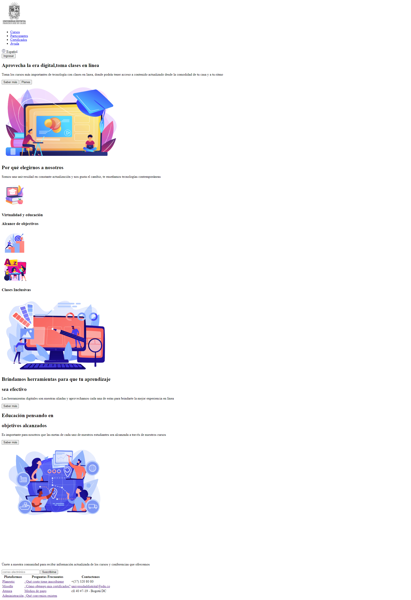
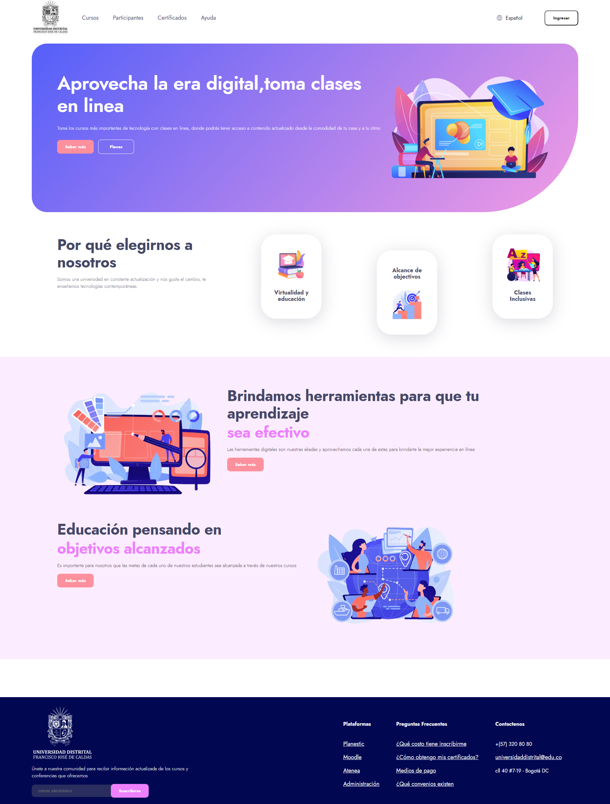
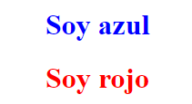
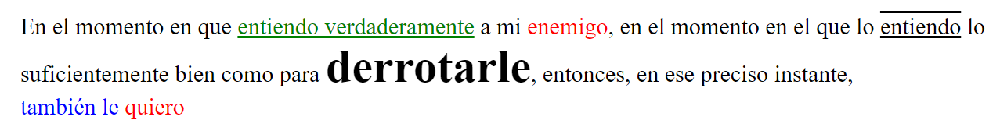
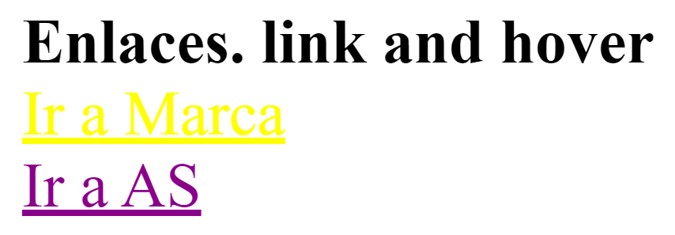
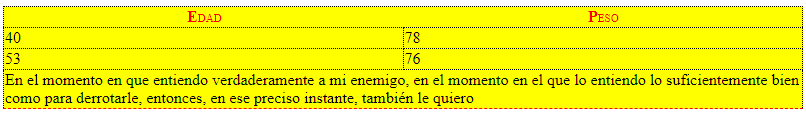

<h1>Taller 9 Juan David Lozano Diaz</h1>

<h2> Información</h2>

Curso: full Stack Basico - Grupo 1

Profesor: Cristian Patiño

<h2> Punto 1: Link figma</h2>

<a href="https://www.figma.com/file/hvnyiDJKStceE838n34Ymd/example?type=design&node-id=30%3A2&mode=design&t=3j0VTvEBF4gNEol6-1" target="_blank">Link de Figma</a>

<h2>Punto 2: HTML</h2>

<h2>Punto 3: CSS</h2>
 

<h2>Punto 4: TITULOS</h2>

<h2>Punto 5: PARRAFO</h2>

<h2>Punto 6: LINKS</h2>

<h2>Punto 7-8: BARRA DE NAVEGACION</h2>

<h2>Punto  9: TABLA</h2>
